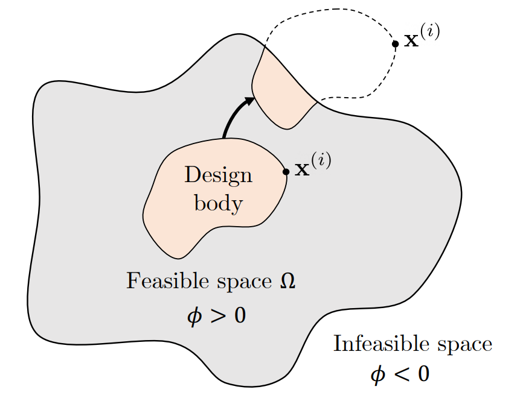
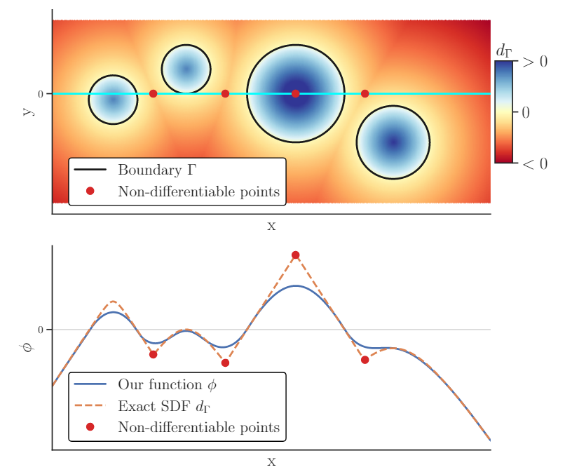
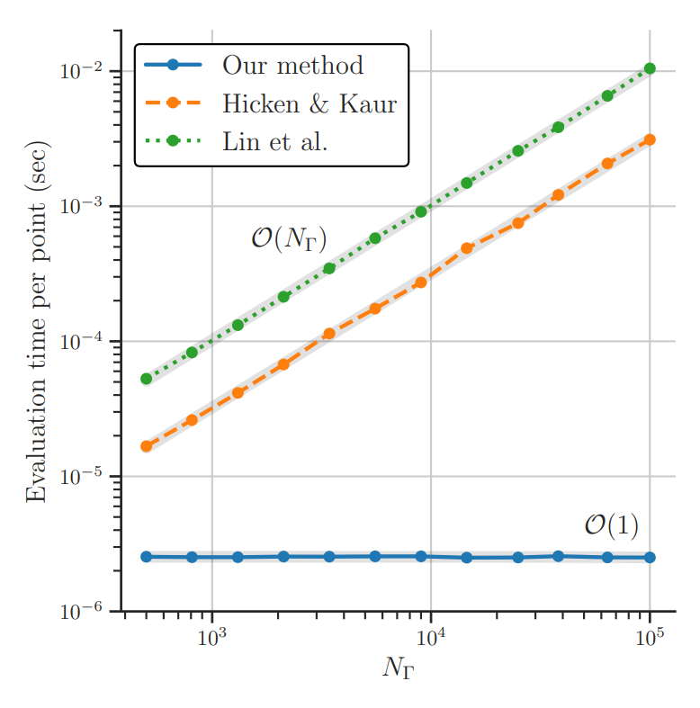
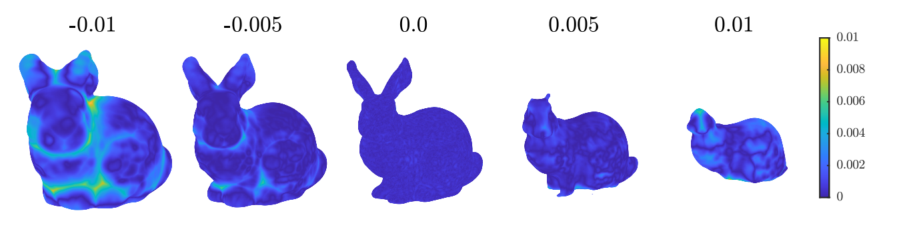

# LSDO Lab's Geometric Non-interference (GeNIe) Constraint Formulation
## INTRODUCTION
Many shape optimization, layout optimization, and optimal path planning problems include constraints to prevent intersection of the design shape with other shapes/boundaries of the environment. We call this constraint a Geometric Non-Interference (GeNIe) constraint, which appears in problems in both 2D and 3D.

    

GeNIe constraint frunctions in gradient-based optimization are required to be smooth and desired to be accurate and fast-to-evaluate. A myopic approach is to use the signed distance function (SDF) to represent the GeNIe constraint, where positive is the feasible region. However, upon closer look, equations representing the SDF are piecewise continuous and nondifferentiable, and scale in computational complexity with the discretization of the geometric shapes/boundaries of the environment

## OUR IDEA
Our approach draws upon existing research from implicit surface reconstruction methods to reconstruct a smooth surface from an oriented point cloud. The implicit function is constructed via an energy minimization step. This step reduces to a sparse, symmetric, positive-definite linear system of equations that is solved on the order of SECONDS, depending on the resolution of Bspline control points you use. The energy minimized GeNIe constraint function will locally approximate the SDF near the geometric shape in smooth way.

    

With the use of Bsplines, our GeNIe constraints have a reduced computational compelexity that does not depend on the discretization of the geometric shapes/boundaries of the environment.

    

Since our GeNIe constraint is a level set function, relaxation approaches are readily available according to the various isocontours of the function.

    

## GETTING STARTED
To install, simply clone this repository and run
'''sh
pip install https://github.com/LSDOlab/lsdo_genie.git
'''

## Brief Tutorial
With your point cloud ready, simply 
'''python
from lsdo_genie import Genie2D, Genie3D
genie = Genie2D()
genie.input_point_cloud(...)
genie.config(...)
genie.solve_energy_minimization(...)
genie.visualize()
'''

To use your constructed GeNIe constraint functio in optimization, simply save the GeNIe object and reload it your optimization problem. Evaluate the constraint function and its gradient by
'''python
phi = genie.compute_phi(points)
dx,dy = genie.gradient_phi(points)
'''

## CITATION
Paper is submitted and under review.
